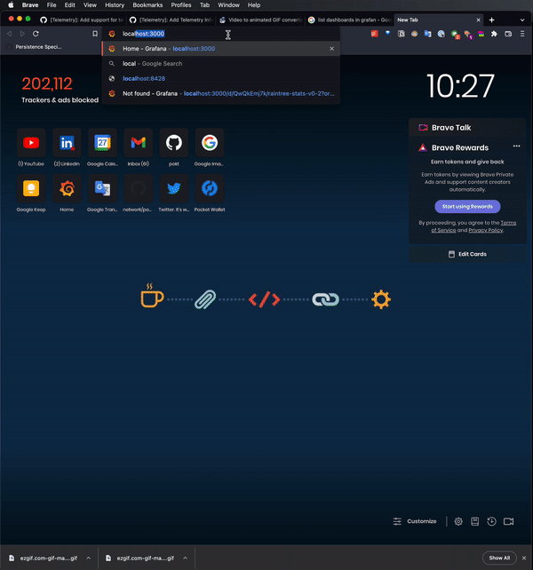

# Welcome to the Telemetry Module

This module is used to collect telemetry data from the node.

At the moment, we are using two types of metrics:

- **Time Series metrics**: Metrics collected at regular intervals and stored in a database. 
[//]: # TODO/INVESTIGATE(team): Replacing logs with a proper events solution for recording Event Metrics.
- **Event series metrics**: Event-driven (i.e. not time-driven) metrics that are stored in a databse.


At the moment, we are using:
- Prometheus: for timeseries
- Plain Logs: for event metrics (_Might be subsituted in the future with an events database_)


# Usage

## Node Configuration

It is necessary to provide a telemetry configuration to your node in `config.json`:

```json
 "enable_telemetry": true,
 "telemetry": {
    "address": "0.0.0.0:9000",
    "endpoint": "/metrics"
  }
```

`enable_telemetry`: configures node to expose telemetry if true.
`address`: is the prometheus server's address that the telemetry module will listen on.
`endpoint`: the endpoint that prometheus exposes through the telemetry module for other serivces to pull the metrics (_usually referred to as the scraping endpoint_).


## Time Series Metrics

If you are not familiar with the time-series concepts related to Prometheus, you can review [Prometheus Metrics](https://prometheus.io/docs/concepts/metric_types/).

We are primarily using:

- Gauges

We use Gauges to keep track of:

- Blockheight
- # of Nodes Online

### How to use the time series metrics in your code

In your module, make sure you have access to the bus, then use the metrics you need as follows:
```go

timeseriesTelemetry := module.GetBus().GetTelemetryModule().GetTimeSeriesAgent()
// explore the methods you can use in shared/modules/telemetry_module.go

// To increment a gauge
timeseriesTelemetry.GaugeIncrement("gauge_name", 1)
// etc...
```

## Event Metrics

In the current implementation, we are recording events through logs.

Using Loki and Grafana, we parse the logs and generate the desired graphs.

In your module, make sure you have access to the bus, then use the metrics you need as follows:
```go
eventMetricsTelemetry := module.GetBus().GetTelemetryModule().GetEventMetricsAgent()
// explore the methods you can use in shared/modules/telemetry_module.go

eventMetricsTelemetry.EmitEvent(
    "namespace",
    "event_name",
    ... // any other fields you want to include
)
```

### Consuming logs in Loki

To test this out, [track an event in your code](#event-metrics), and then go to your [Grafana's local setup's link](#using-grafana), and to the the explore page.

Run the following LogQL query:

```
{host="desktop-docker"} |= "[EVENT] your_namespace your_event" | pattern `<datetime> <_> <time> <type> <event_name> <any> <aditional> <whitespaced> <items>` | logfmt
```
An example of how to use the `Explore` functionality is available in:

Go to the explore page:


Type in your query and play with the results:


You should see a log stream coming out, click a line to explore how you've used the `pattern` keyword in LogQL to parse the log line. Now you can reference your parsed fields as you like. Example:

Counting how many events we've seen by type over 5m:
```logql
sum by (type) (count_over_time(
    {host="desktop-docker"}
    |= "[EVENT] your_namespace"
    | pattern `<datetime> <_> <time> <type> <event_name> <any> <aditional> <whitespaced> <items>`[5m]
))
```
Counting how many events of a certain type have we seen over 5m:
```logql
sum (count_over_time(
    {host="desktop-docker"}
    |= "[EVENT] your_namespace your_event"
    | pattern `<datetime> <_> <time> <type> <event_name> <any> <aditional> <whitespaced> <items>`[5m]
))
```

### Using Grafana

To launch and start using Grafana, do the following:

1. Spin up the stack
```bash
$ make compose_and_watch
```

2. Wait a few seconds and then visit: `https://localhost:3000`.
3. Voila! You are there. You can browse existing dashbaords by navigating to the sidebar on Grafana and clicking on `Search Dashboards`:


